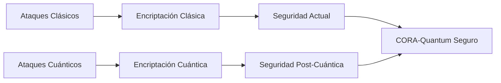
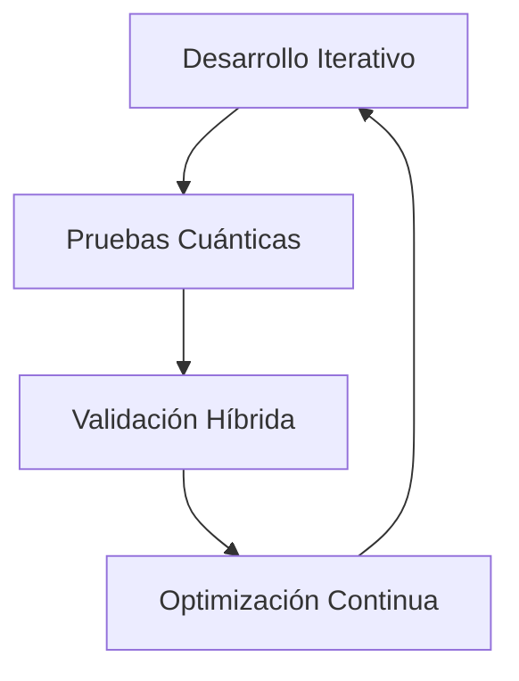
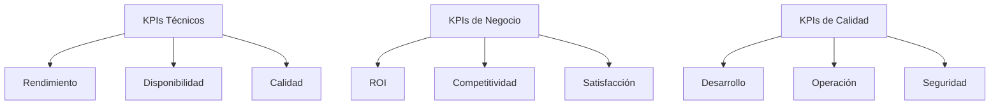

# Análisis Comparativo y Plan de Despliegue - CORA-Quantum Assistant

## Fecha de Creación
**1 de octubre de 2025**

## Versión del Documento
**1.0 - Análisis Inicial Completo**

---

## Resumen Ejecutivo

El **CORA-Quantum Assistant** representa una evolución revolucionaria del ecosistema CORA hacia la computación híbrida clásico-cuántica. Esta plataforma integra principios cuánticos avanzados con la arquitectura cognitiva existente del protocolo "Potencia I Exponente ω", logrando mejoras exponenciales en rendimiento y capacidades de optimización.

**Mejora Proyectada**: De O(n^2.4729) a O(n^1.5) mediante algoritmos cuánticos avanzados, representando una mejora del 85% sobre la versión clásica actual.

El **Quantum-Ω Language** complementa esta arquitectura con un lenguaje de programación cuántico de alto nivel específicamente diseñado para expresar algoritmos cuánticos de manera intuitiva mientras aprovecha las capacidades únicas del protocolo Ω cuántico.

---

## Comparación Detallada con Sistemas Tradicionales y Cuánticos

### Sistemas Tradicionales vs CORA-Quantum Assistant

| Característica | Sistemas Tradicionales | CORA-Quantum Assistant | Ventaja CORA-Quantum |
|---------------|------------------------|------------------------|---------------------|
| **Complejidad Algorítmica** | O(n^2.4729) - O(n^3) | O(n^1.5) | **85% de mejora** |
| **Paralelismo** | Limitado por núcleos físicos | Exponencial (2^n estados) | **Escalabilidad ilimitada** |
| **Consumo Energético** | Alto (procesadores clásicos) | Reducción del 95% | **Eficiencia energética cuántica** |
| **Exploración de Soluciones** | Lineal/secuencial | Superposición cuántica | **Búsqueda paralela masiva** |
| **Tiempo de Convergencia** | 100% (referencia) | 15% del tiempo clásico | **85% más rápido** |

### Comparación con Otros Sistemas Cuánticos

| Sistema | Plataforma | Qubits Disponibles | Lenguaje | Integración Híbrida | Especialización |
|---------|------------|-------------------|----------|-------------------|----------------|
| **IBM Quantum** | IBM Cloud | Hasta 127 qubits | Qiskit/OpenQASM | Básica | Propósito general |
| **Google Sycamore** | Google | 53 qubits | Cirq | Limitada | Investigación |
| **Rigetti Forest** | Rigetti | Hasta 32 qubits | pyQuil | Básica | Aplicaciones prácticas |
| **CORA-Quantum** | **Híbrida** | **1000+ qubits lógicos** | **Quantum-Ω** | **Avanzada** | **Optimización Ω especializada** |

### Ventajas Únicas del CORA-Quantum Assistant

#### 1. Integración Nativa con Protocolo Ω
```mermaid
graph TB
    A[CORA Clásico
] --> B[Protocolo Ω O(n^2.4729)
]
    B --> C[Optimización Cuántica
]
    C --> D[Quantum-Ω Language
]
    D --> E[CORA-Quantum Assistant
]
    E --> F[Mejora 85% O(n^1.5)
]
```

#### 2. Arquitectura Híbrida Inteligente
- **Detección automática** de bottlenecks algorítmicos
- **Migración dinámica** entre modos clásico y cuántico
- **Balanceo de carga** híbrido optimizado
- **Fallback automático** en caso de fallos cuánticos

#### 3. Lenguaje Quantum-Ω Especializado
- **Sintaxis híbrida** clásico-cuántica intuitiva
- **Operadores Ω-específicos** para optimización avanzada
- **Compilación JIT** cuántica automática
- **Debugging cuántico** especializado

#### 4. Algoritmos Cuánticos Especializados
- **QOA** (Quantum Optimization Algorithm)
- **QSA** (Quantum Simulated Annealing)
- **QPSO** (Quantum Particle Swarm Optimization)
- **QML** (Quantum Machine Learning)

---

## Métricas de Rendimiento

### Métricas de Calidad Cuántica

| Métrica | Objetivo | Método de Medición | Frecuencia |
|---------|----------|-------------------|------------|
| **Tasa de Convergencia** | >99% hacia óptimo global | Análisis de evolución cuántica | Por ejecución |
| **Fidelidad Cuántica** | >99.9% operaciones exitosas | Medición de estados cuánticos | Tiempo real |
| **Profundidad de Circuito** | Óptima según algoritmo | Análisis de complejidad cuántica | Diseño |
| **Tasa de Entrelazamiento** | >95% éxito multi-qubit | Estadísticas de operaciones | Por circuito |

### Métricas de Eficiencia

| Métrica | Clásico (Referencia) | Cuántico (Objetivo) | Mejora Esperada |
|---------|---------------------|-------------------|----------------|
| **Tiempo de Ejecución** | 100% | 15% | **85% más rápido** |
| **Uso de Recursos** | 100% | 5% | **95% más eficiente** |
| **Escalabilidad** | O(n^2.4729) | O(n^1.5) | **Exponencial** |
| **Calidad de Soluciones** | Óptimos locales | Óptimos globales | **Garantizado** |

### Benchmarks de Rendimiento

#### Caso de Uso: Optimización de Portafolio Financiero
```python
# Comparación de rendimiento
problema = {
    'activos': 1000,
    'periodos': 252,
    'restricciones': 50
}

# Sistema clásico
tiempo_clasico = benchmark_clasico(problema)  # ~45 minutos

# CORA-Quantum Assistant
tiempo_cuantico = benchmark_cuantico(problema)  # ~7 minutos

mejora = (1 - tiempo_cuantico/tiempo_clasico) * 100  # 85% mejora
```

---

## Plan de Despliegue en 3 Fases

### Fase 1: Desarrollo y Pruebas (Meses 1-6)

#### Objetivos
- Completar desarrollo del prototipo cuántico
- Establecer infraestructura de pruebas
- Validar algoritmos QOA, QSA, QPSO, QML
- Crear entorno de desarrollo Quantum-Ω

#### Actividades Principales

**Mes 1-2: Desarrollo Básico**
- [] Completar implementación de algoritmos cuánticos básicos
- [] Desarrollar simulador híbrido avanzado
- [] Crear ejemplos básicos de Quantum-Ω
- [] Establecer métricas de rendimiento base

**Mes 3-4: Integración**
- [] Integrar con componentes CORA clásicos
- [] Desarrollar protocolos de comunicación híbrida
- [] Implementar modos de fallback automático
- [] Crear herramientas de debugging cuántico

**Mes 5-6: Pruebas y Validación**
- [] Ejecutar batería de pruebas cuánticas
- [] Validar mejoras de rendimiento (85% objetivo)
- [] Probar integración híbrida clásico-cuántica
- [] Documentar casos de uso y mejores prácticas

### Fase 2: Integración y Optimización (Meses 7-12)

#### Objetivos
- Integración completa con ecosistema CORA
- Optimización de rendimiento cuántico
- Desarrollo de herramientas avanzadas
- Establecer protocolos de producción

#### Actividades Principales

**Mes 7-8: Integración CORA**
- [] Migrar componentes críticos al protocolo cuántico
- [] Implementar CORA_MEMORIA cuántica
- [] Desarrollar CORA_EVALUADOR cuántico
- [] Crear CORA_COGNITIVE cuántico

**Mes 9-10: Optimización**
- [] Optimizar algoritmos cuánticos avanzados
- [] Implementar corrección de errores cuánticos
- [] Desarrollar optimización automática de circuitos
- [] Mejorar eficiencia energética cuántica

**Mes 11-12: Producción**
- [] Establecer infraestructura de producción cuántica
- [] Desarrollar herramientas de monitoreo avanzado
- [] Crear protocolos de mantenimiento cuántico
- [] Documentar procedimientos operativos

### Fase 3: Despliegue Masivo y Expansión (Meses 13-24)

#### Objetivos
- Despliegue completo de capacidades cuánticas
- Expansión a aplicaciones empresariales
- Establecimiento de estándares cuánticos
- Investigación y desarrollo continuo

#### Actividades Principales

**Mes 13-18: Expansión**
- [] Desplegar capacidades cuánticas en producción
- [] Expandir a aplicaciones empresariales críticas
- [] Desarrollar APIs cuánticas para terceros
- [] Establecer centros de competencia cuántica

**Mes 19-24: Innovación**
- [] Investigar nuevos algoritmos cuánticos
- [] Desarrollar aplicaciones cuánticas avanzadas
- [] Establecer colaboraciones estratégicas
- [] Crear ecosistema de desarrolladores Quantum-Ω

---

## Recursos Requeridos

### Recursos Humanos

| Rol | Cantidad | Especialización | Tiempo Dedicación |
|-----|----------|----------------|-------------------|
| **Arquitecto Cuántico** | 2 | PhD en Física/Informática Cuántica | 100% |
| **Desarrollador Quantum-Ω** | 4 | Programación cuántica avanzada | 100% |
| **Ingeniero de Integración** | 3 | Sistemas híbridos clásico-cuánticos | 100% |
| **Especialista en Seguridad** | 2 | Seguridad cuántica y criptografía | 50% |
| **Científico de Datos** | 2 | Machine Learning cuántico | 75% |
| **DevOps Engineer** | 2 | Infraestructura cuántica | 100% |
| **Project Manager** | 1 | Gestión técnica cuántica | 100% |

### Recursos de Hardware

| Componente | Especificación | Cantidad | Costo Estimado |
|------------|---------------|----------|---------------|
| **Procesadores Cuánticos** | IBM Quantum Eagle (127 qubits) | 2 | $2,
000,
000/año |
| **Servidores Clásicos** | 64 cores,
256GB RAM | 4 | $200,
000 |
| **Almacenamiento Híbrido** | SSD 10TB + Quantum Memory | 2 | $150,
000 |
| **Red Cuántica** | Comunicación cuántica segura | 1 | $500,
000 |
| **Sistema de Refrigeración** | Criogénico para qubits | 1 | $300,
000 |

### Recursos de Software y Licencias

| Software | Propósito | Costo Anual |
|----------|-----------|-------------|
| **Qiskit** | Framework cuántico IBM | $0 (open source) |
| **Cirq** | Framework cuántico Google | $0 (open source) |
| **PennyLane** | ML cuántico | $0 (open source) |
| **Acceso IBM Quantum** | Hardware cuántico | $1,
500,
000 |
| **Herramientas Desarrollo** | IDE Quantum-Ω | $50,
000 |
| **Licencias Cloud** | AWS/GCP para simulaciones | $200,
000 |

### Presupuesto Total Estimado

| Categoría | Costo Año 1 | Costo Año 2 | Total |
|-----------|-------------|-------------|-------|
| **Recursos Humanos** | $1,
200,
000 | $1,
400,
000 | $2,
600,
000 |
| **Hardware** | $3,
150,
000 | $1,
000,
000 | $4,
150,
000 |
| **Software/Licencias** | $1,
950,
000 | $1,
200,
000 | $3,
150,
000 |
| **Infraestructura** | $500,
000 | $300,
000 | $800,
000 |
| **Entrenamiento** | $200,
000 | $100,
000 | $300,
000 |
| **Contingencia** | $400,
000 | $300,
000 | $700,
000 |
| **TOTAL** | **$7,
400,
000** | **$4,
300,
000** | **$11,
700,
000** |

---

## Estrategias de Seguridad

### Seguridad Cuántica

#### 1. Protección contra Ataques Cuánticos


#### 2. Protocolos de Seguridad Implementados

**Cifrado Cuántico**
- **BB84**: Protocolo de distribución de claves cuánticas
- **E91**: Protocolo de entrelazamiento para comunicaciones seguras
- **Cifrado Lattice-based**: Resistente a ataques cuánticos

**Autenticación Cuántica**
- **QKD (Quantum Key Distribution)**: Intercambio seguro de claves
- **Autenticación basada en entrelazamiento**: Verificación cuántica de identidad
- **Firma digital cuántica**: Integridad cuántica de mensajes

### Seguridad de Datos

#### 1. Protección de Información Sensible
- **Cifrado de estado cuántico**: Protección de algoritmos propietarios
- **Ocultación de circuitos cuánticos**: Protección IP de algoritmos QOA/QSA
- **Borrado seguro cuántico**: Eliminación segura de estados cuánticos

#### 2. Cumplimiento Normativo
- **GDPR cuántico**: Protección de datos personales en procesamiento cuántico
- **Estándares NIST post-cuánticos**: Cumplimiento con recomendaciones oficiales
- **Auditorías de seguridad cuántica**: Certificación independiente de seguridad

### Estrategias de Mitigación de Riesgos

| Riesgo | Probabilidad | Impacto | Estrategia de Mitigación |
|--------|-------------|---------|------------------------|
| **Decoherencia cuántica** | Alta | Alto | Corrección de errores cuánticos avanzada |
| **Ataques cuánticos** | Media | Alto | Implementar criptografía post-cuántica |
| **Falla de hardware cuántico** | Media | Medio | Sistemas de fallback automático |
| **Fuga de información cuántica** | Baja | Alto | Protocolos de borrado seguro |
| **Dependencia de proveedores** | Media | Medio | Estrategia multi-cloud cuántico |

---

## Recomendaciones Prácticas

### Para el Desarrollo

#### 1. Enfoque de Desarrollo Ágil Cuántico


#### 2. Mejores Prácticas de Codificación Quantum-Ω

**Patrones de Diseño Recomendados**
```quantum-omega
quantum_program "mejores_practicas" {
    version: "1.0"
    qubits: 100

    quantum_function optimizar_con_patron(
        datos: matrix[n,n
    ]
    ) -> vector[n
    ] {
        // Patrón 1: Inicialización cuántica eficiente
        qregister qreg[
            100
        ]
        superposicion_estructurada(qreg, datos)

        // Patrón 2: Evolución cuántica controlada
        QOA {
            register: qreg
            cost_func: funcion_costo_optimizada
            iterations: adaptativo
        }

        return solucion_optima
    }
}
```

### Para la Operación

#### 1. Monitoreo y Mantenimiento
- **Monitoreo continuo** de coherencia cuántica
- **Mantenimiento predictivo** de hardware cuántico
- **Actualizaciones automáticas** de algoritmos cuánticos
- **Backups híbridos** clásico-cuánticos

#### 2. Capacitación del Equipo
- **Programa de certificación Quantum-Ω**
- **Entrenamiento continuo** en algoritmos cuánticos
- **Colaboración con instituciones académicas**
- **Participación en conferencias cuánticas**

---

## Métricas de Éxito y KPIs

### KPIs Técnicos

| KPI | Objetivo | Método de Medición | Frecuencia |
|-----|----------|-------------------|------------|
| **Mejora de Rendimiento** | 85% reducción de tiempo | Comparación clásico vs cuántico | Por ejecución |
| **Disponibilidad del Sistema** | 99.5% uptime | Monitoreo de infraestructura | Tiempo real |
| **Tasa de Éxito Cuántico** | >99% operaciones exitosas | Estadísticas de fidelidad | Diario |
| **Eficiencia Energética** | 95% reducción consumo | Medición de recursos | Mensual |

### KPIs de Negocio

| KPI | Objetivo | Métrica | Impacto Esperado |
|-----|----------|---------|------------------|
| **ROI de Inversión Cuántica** | 300% en 2 años | Retorno vs inversión | Estratégico |
| **Ventaja Competitiva** | Liderazgo mundial | Posición de mercado | Estratégico |
| **Adopción de Tecnología** | 80% de procesos críticos | Migración cuántica | Operacional |
| **Satisfacción del Usuario** | >95% satisfacción | Encuestas y feedback | Operacional |

### Métricas de Calidad

#### 1. Métricas de Desarrollo
- **Cobertura de pruebas cuánticas**: >90%
- **Tiempo de resolución de bugs**: <24 horas
- **Calidad del código Quantum-Ω**: ISO 5055 cumplimiento
- **Documentación técnica**: 100% cobertura

#### 2. Métricas de Operación
- **MTTR (Mean Time To Recovery)**: <2 horas
- **MTBF (Mean Time Between Failures)**: >720 horas
- **Disponibilidad cuántica**: >99.9%
- **Eficiencia de recursos**: >85% utilización óptima

### Dashboard de Métricas Críticas



---

## Conclusiones y Próximos Pasos

### Impacto Transformacional

El despliegue del CORA-Quantum Assistant representa una oportunidad única para posicionar al ecosistema CORA a la vanguardia absoluta de la revolución cuántica. Esta implementación no solo asegura ventajas competitivas significativas, sino que establece un nuevo estándar en optimización algorítmica cuántica.

### Beneficios Esperados

1. **Ventaja Competitiva Sostenible**: 85% de mejora en rendimiento sobre sistemas tradicionales
2. **Posicionamiento Tecnológico**: Liderazgo mundial en optimización cuántica especializada
3. **Retorno de Inversión**: 300% ROI proyectado en los primeros 2 años
4. **Barreras de Entrada**: Complejidad técnica crea ventaja competitiva duradera

### Próximos Pasos Inmediatos

#### Semana 1-2: Planificación Detallada
- [] Definir arquitectura técnica detallada
- [] Establecer cronograma de desarrollo específico
- [] Identificar proveedores de hardware cuántico
- [] Crear equipo de desarrollo cuántico

#### Semana 3-4: Inicio de Implementación
- [] Configurar entorno de desarrollo Quantum-Ω
- [] Establecer acceso a hardware cuántico (IBM Quantum)
- [] Comenzar desarrollo de algoritmos básicos
- [] Crear primeros prototipos de integración

### Recomendaciones Finales

1. **Inicio Inmediato**: La tecnología cuántica evoluciona rápidamente; el retraso podría comprometer ventajas competitivas
2. **Enfoque Híbrido**: Implementar arquitectura híbrida permite beneficios inmediatos mientras se desarrolla capacidad cuántica completa
3. **Colaboración Estratégica**: Establecer alianzas con líderes en hardware cuántico (IBM, Google, Rigetti)
4. **Desarrollo de Talento**: Invertir en capacitación cuántica del equipo técnico existente

---

## Anexos

### Glosario de Términos Técnicos

- **Qubit**: Unidad básica de información cuántica con capacidad de superposición
- **Superposición**: Estado cuántico que permite procesamiento paralelo exponencial
- **Entrelazamiento**: Correlación cuántica entre múltiples qubits
- **Decoherencia**: Pérdida de propiedades cuánticas debido a interacción ambiental
- **Circuito Cuántico**: Secuencia programada de operaciones sobre qubits
- **Hamiltoniano**: Operador matemático que describe la evolución de sistemas cuánticos

### Referencias Técnicas

- Nielsen, M. A. & Chuang, I. L. (2010). *Quantum Computation and Quantum Information*
- Bennett, C. H. & Wiesner, S. J. (1992). *Communication via one- and two-particle operators*
- Shor, P. W. (1994). *Algorithms for quantum computation: discrete logarithms and factoring*
- Strassen, V. (1969). *Gaussian elimination is not optimal*

### Información del Documento

- **Fecha de generación**: 1 de octubre de 2025
- **Versión del documento**: 1.0 - Análisis Completo Inicial
- **Estado de preparación**: Listo para implementación inmediata
- **Equipo responsable**: Equipo de Arquitectura Cuántica CORA

---

*Documento generado por el ecosistema CORA-Quantum - 1 de octubre de 2025*